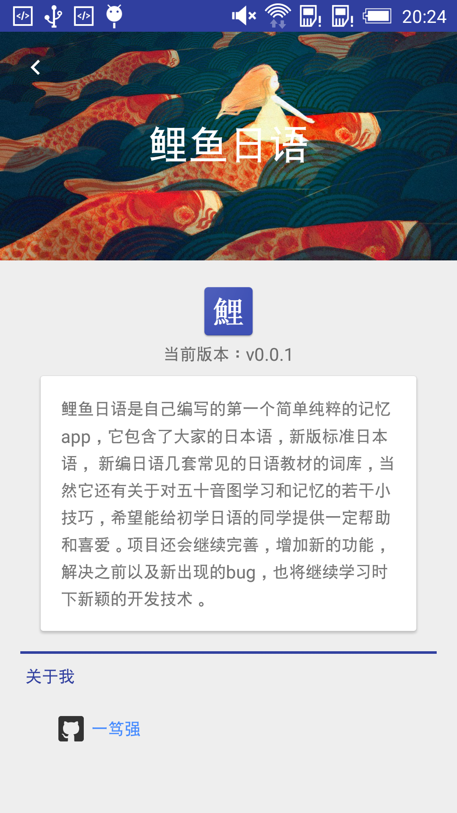
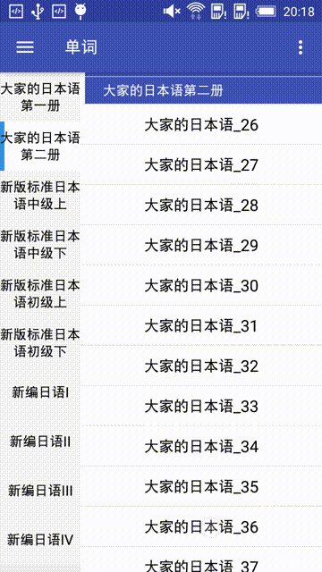
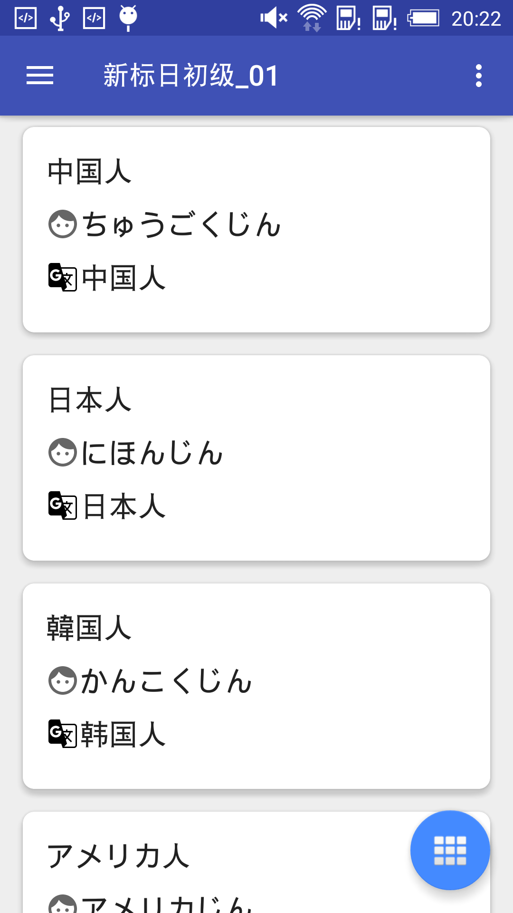
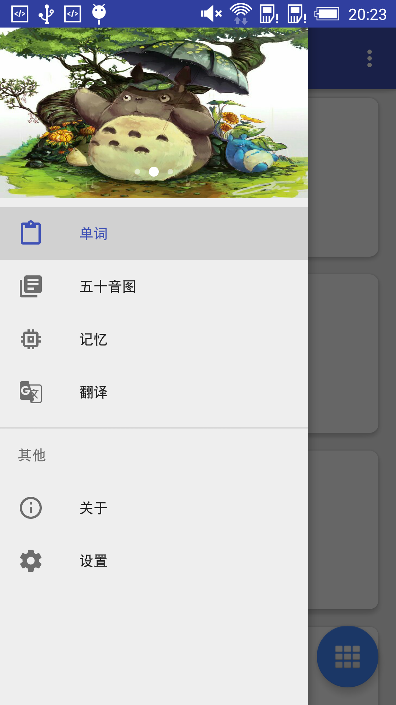
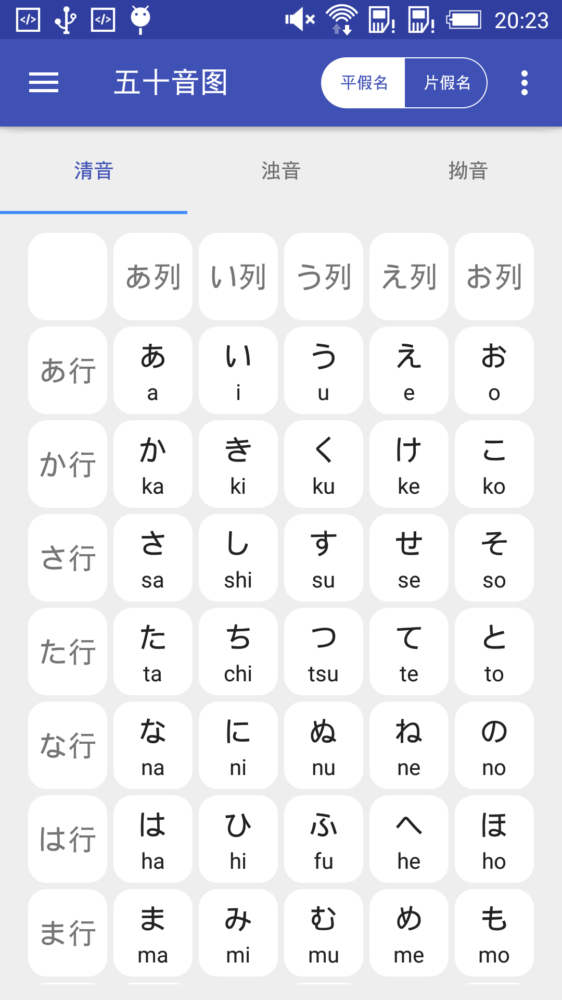

# 鲤鱼日语
鲤鱼日语本版本基于MVP+RxJava+Retrofit,是自己编写的第一个简单纯粹的记忆app，它包含了大家的日本语，新版标准日本语，新编日语几套常见的日语教材的词库，当然它还有关于对五十音图学习和记忆的若干小技巧，希望能给初学日语的同学提供一定帮助和喜爱。项目还会继续完善，增加新的功能，解决之前以及新出现的bug，也将继续学习时下新颖的开发技术。
目前还是有些问题的，会继续添加新模块，不断迭代。

依赖全部更新到新版，适配Android 8.0.

# 效果图

    

   

# 关于我
一个努力连接点线面的人，喜欢做产品。

### 感谢阅读，如果喜欢就给个star吧。